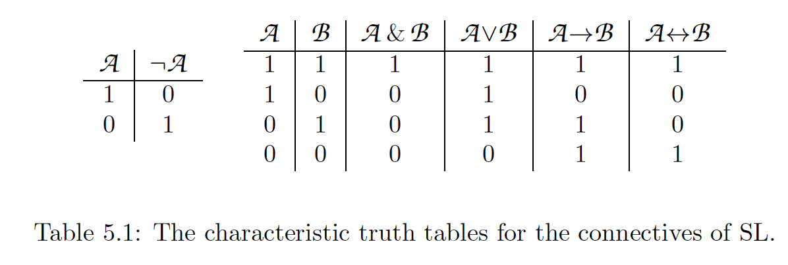

# CP
Competitive Programmer's HandBook by Antti Laaksonen
# Basic techniques
- [1. Intro](#1Intro)
- [2. Time complexity](#2Time-complexity)
- [3. Sorting](#3Sorting)
- [4. Data Structures](#4DataStructures)
- [5. Complete search](#5CompleteSearch)
---
## 1.Intro

>**to make input and output more efficient:**
>```c++
>ios::sync_with_stdio(0)
>cin.tie(0)
>```

>**reads from input.txt and writes on output.txt:**
>```c++
>freopen("input.txt", "r", stdin);
>freopen("output.txt", "w", stdout);
>```

>**input:**
>```c++
>int a, b;
>string x;
>cin >> a >> b >> x;
>//alternative
>scanf("%d %d", &a, &b)
>// reading a hole line from input (including spaces)
>string s;
>getline(cin, s);
>// if the amount of data is unknown
>while(cin >> x){
>    //code
>}
>```


>**output:**
> ```c++
>int a = 123, b = 467;
>string x = "monkey";
>cout << a << " " << b << " " << x << "\n";
>//
>printf("%d %d\n", a, b)
>```

\n works faster than endl

>**working with numbers:**
<br>
int(32-bit)
<br>
long long (64-bit)
<br>

>**modular arithmetic:**
>```c++
>//to calculate n! 
>long long x = 1;
>for (int i = 2; i <= n; i++){
>    x = (x*i)%m;
>}
>cout << x%m << "\n";
>// if we dont want negative remainders
>x = x%m;
>if(x<0) x += m;
>```

>**floating point numbers**
> <br> double(64-bit)
> <br> long double(80-bit)
> ```c++
>   //prints the value of x with 9 decimal places:
> printf("%.9f\n", x);
> // floating point numbers are equal if the difference between them is less than e (1e-9)
> if(abs(a-b)<1e-9){
>   // a and b are equal
> }
> ```

>### Shortening code:
> <br> to write as fast as possible
> 
>```c++
>//type names: typedef
>typedef long long ll;
>ll a = 12345677;
>ll b = 987654321;
>typedef vector<int> vi;
>typedef pair<int, int> pi;
>
>//macros: #define
>#define F first
>#define S second
>#define PB push_back
>#define MP make_pair
>v.PB(MP(y1,x1));
>int d = v[i].F+v[i].S;
>//it can also have parameters
>#define REP(i,a,b) for (int i = a; i <=b; i++)
>REP{
>   search(i);
>}
>#define SQ(a) (a)*(a)
>```

>### Mathematics:
> ***arithmetic progression:*** 
> <br>sequence of numbers where the jumps are constant. (3,7,11,15)
> <br>a+...+b=n(a+b)/2
> <br>
> ***geometric progression:***
> <br>sequence of numbers where the ratio of the jumps is constant.(3, 6, 12, 24)
> <br> a+ak+ak^2+...+b=(bk-a)/k-1
> <br>
> ***harmonic sum:***
> <br>1+1/2+1/3+...+1/n.

>### Set Theory:
> A set is a collection of elements. 
> - X = {2,4,8}
> - ∅ empty set
> - |X| size of the set X
> - 4  ∈ X and 5 ∌ X
> - Intersection: elements both in A and B
> - Union: elements in A or in B or in both.
> - Complement: elements not in A.
> - difference: elements in A but not in B.
> - If each element of A also belongs to S, A is a subset of S.
> - subsets of X = ∅, {2}, {4}, {8}, {2,4}, {2,8}, {4,8} and {2,4,8}
> - X = {2n: n ∈ Z} the set contains all even integers.

>### Logic:
> 
> quantifiers!!

>### Functions:
>  - ⌊ ⌋ round down
>  - ⌈ ⌉ round up
>  - min(x,y,z) gives the smallest value
>  - max(x,y,z) gives the largest value
>  - n! = 1*2*3*...*n
>  - fibonacci: f(n) = (1+√5)^n-(1-√5)^n/2^n√5

>### Logarithms:
>- log_k(x) = a == k^a = x
>- log_k(x): number of times we have to divide x by k before we reach 1. the base is k
>- log_k(ab)   = log_k(a) + log_k(b)
>- log_k(x^n)  =  n * log_k(x)
>- log_k(a/b)  = log_k(a) - log_k(b)
>- log_u(x)    =  log_k(x)/log_k(u)
>- ln(x) log whose base is e=2.71828

---

## 2.Time complexity 
estimates how much time the algorithm will use for some input. 
By calculating the time complexity, we can find out whether the algorithm is fast enough
without implementing it.

>**Calculation Rules**
>- Loops: O($n^k$) k nested loops, if the nested loop has dif variable (m) is O(nm)
>- the total time complexity is the largest time complexity of a single phase
>- Recursion: number of times the function is called and the time complexity of a single call.

>**Complexity Classes**
> 1. O(1): does not depend on the input size
> 2. O(log_n): halves the input size at each step
> 3. O(√n): 
> 4. O(n): best possible time complexity, goes through the input a constant n of times
> 5. O(nlog_n): sorts the input
> 6. O($n^2$): two nested loops
> 7. O($n^3$): three nested loops
> 8. O($2^n$): iterates through all subsets of the input elements.
> 9. O(n!): iterates through all permutations of the input elements.

>**Polynomial**: its time complexity is at most O(n^k)

NP-hard problems are problems for which no polynomial algorithm i s known
>**Estimating efficiency:**
> <br>before implementing the algorithm, we calculate the time 
> complexity to  check if it is efficient enough for the problem.<br>
> | input size | required time complexity |
> | ----------- | ----------- |
> | n <=10 | O(n!) |
> | n <=20 | O(2^n) |
> | n <=500 | O(n^3) |
> | n <=1000 | O(n^2) |
> | n <=1e6 | O(nlog_n) or O(n) |
> | n is large | O(1) or O(log_n) |

>**Maximum subarray sum**
> given an array of n numbers our task is to calculate the largest possible
> sum of a sequence of consecutive values in the array. There may be negatives.<br><br>

 ***Algorithm 1*** O($n^3$)
 ```c++
 int best =  0;
 for (int a=0; a<n; b++){
   for(int b=a; b<n; b++){
     int sum=0;
      for(int k=a; k<0b; k++){
        sum += array[k];
     }  
     best =  max(best, sum)
   }
 }
 cout << best << "\n";
```
***Algorithm 2*** O($n^2$)
```c++
int best = 0;
for(int a=0; a<n; b++){
    int sum=0;
    for(int b=a; b<n; b++){
        sum += array[b];
        best = max(best,sum);
    }
}
cout << best << "\n";
```
***Algorithm 3*** O(n)
```c++
int best=0, sum=0;
for(int k=0; k<n; k++){
    sum = max(array[k],sum+array[k]);
    best = max(best, sum);
}
cout << best << "\n";
```


## 3.Sorting
sorting is a fundamental algorithm design problem. Time complexity O(nlog_n).

> **bubble sort** 
>  O($n^2$)<br>go through all elements and put the big ones at the end in each iteration


> **merge sort**
> $O(n log_n)$<br> divide and conquer

> **counting sort**
> $O(n)$<br>we assume that every element in the array is an integer between 0 and c

>**sorting in c++** 
<br>function sort of the standard library 
```c++
//sorting a vector
vector<int> v = {4,2,5,3,5,8,3};
sort(v.begin(),v.end()); //sorts in increasing order
sort(v.rbegin(), v.rend()); //sorts in reverse order

//sorting an array
int n = 7; //array size
int a[] = {4,2,5,3,5,8,3};
sort(a,a+n)

//sorting a string
string s = "monkey";
sort(s.begin(), s.end());

//pairs and tuples are sorted primarily by the first element, secondary the second...
vector<pair<int,int>> v;
sort(v.begin(), v.end());
vector<tuple<int, int, int>> v;
sort(v.begin(), v.end());
```
---
>**User-defined structs**
> <br>we have to define comparison operator, for example:
```c++
struct P{
    int x, y;
    bool operator<(const P &p){
        if(x != p.x) return x < p.x;
        else return y < p.y;
    }
};
```
>**Comparison functions**<br>give and external comparison to the sort function
```c++
bool comp(string a , string b) {
    if (a.size() != b.size()) return a.size < b.size();
    return a < b;
};
sort (v.begin(), v.end(), comp);
```
--- 
> **binary search**

general method $O(n)$:
<br>we go through each element in the array
```c++
for(int i = 0; i < n; i++) {
    if (array[i]==x){
        // x found at index i
    }
}
```
method 1 $O(nlog_n)$:  
<br>in a sorted array, we check the middle element and depending on it we terminate, 
go to the left or to the right.
```c++
int a = 0, b = n-1;
while(a<= b) {
    int k = (a+b)/2;
    if (array[k] == x){
        x found at index k
    }
    if (array[k] > x) b = k-1;
    else a = k+1;
}
```
method 2 $O(log_n)$:
<br>make jumps and slow the speed when we get closer to the target element
```c++
int k = 0;
for (int b=n/2; b>= 1; b /=2) {
    while(k+b < n && array[k+b] <= x) k += b;
}
if (array[k] == x){
    //x found at index k
}
```
---
>**c++ functions** (sorted arrays) 
> - lower_bound: returns a pointer to the first array element whose value is at least x
> <br>Ex: finds out whether an array contains an element with value x
> ```c++
> auto k = lower_bound(array, array+n, x)-array;
> if (k < n && array[k] == x){
>   //x found at index k
> }      
>```
> - upper_bound: returns a pointer to the first array element whose value is larger than x
> <br>Ex: counts the number of elements whose value is x
> ```c++
> auto a = lower_bound(array, array+n, x);
> auto b = upper_bound(array, array+n, x);
> cout << b-a << "\n";
>```
> - equal_range: returns both above pointers.
> ```c++
> auto r = equal_range(array, array+n, x);
> cout << r.second-r.first << "\n";
>```

>**finding the smallest solution**

> **finding the maximum value**
 
 
## 4. Data Structures
## 5. Complete Search 
## 6. Greedy algorithms

<details>
  <summary><h3> 7. Dynamic Programming </h3></summary>

<!-- Add your notes or content for Dynamic Programming here. -->

</details>

<details>
  <summary><h3> 8. Amortized Analysis </h3></summary>

<!-- Add your notes or content for Amortized analysis here. -->

</details>

<details>
  <summary><h3> 9. Range queries </h3></summary>

<!-- Add your notes or content for Range queries here. -->

</details>

<details>
  <summary><h3> 10. Bit manipulation </h3></summary>

<!-- Add your notes or content for Bit manipulation here. -->

</details>

---
# Graph Algorithms
<details>
  <summary><h3>11. Basics of graphs</h3></summary>
</details>
<details>
  <summary><h3>12. Graph traversal</h3></summary>
</details>
<details>
  <summary><h3>13. Shortest paths</h3></summary>
</details>
<details>
  <summary><h3>14. Tree algorithms</h3></summary>
</details>
<details>
  <summary><h3>15. Spanning trees</h3></summary>
</details>
<details>
  <summary><h3>16. Directed graphs</h3></summary>
</details>
<details>
  <summary><h3>17. Strong connectivity</h3></summary>
</details>
<details>
  <summary><h3>18.Tree queries</h3></summary>
</details>
<details>
  <summary><h3>19. Paths and circuits</h3></summary>
</details>
<details>
  <summary><h3>20. Flows and cuts</h3></summary>
</details>

---
# Advanced topics
<details>
  <summary><h3>21. Number theory</h3></summary>
</details>
<details>
  <summary><h3>22. Combinatorics</h3></summary>
</details>
<details>
  <summary><h3>23. Matrices</h3></summary>
</details>
<details>
  <summary><h3>24. Probability</h3></summary>
</details>
<details>
  <summary><h3>25. game theory</h3></summary>
</details>
<details>
  <summary><h3>26. String Algorithms</h3></summary>
</details>
<details>
  <summary><h3>27. Square root algorithms</h3></summary>
</details>
<details>
  <summary><h3>28. Segment trees revisited</h3></summary>
</details>
<details>
  <summary><h3>29. Geometry</h3></summary>
</details>
<details>
  <summary><h3>30. Sweep line algorithms</h3></summary>
</details>